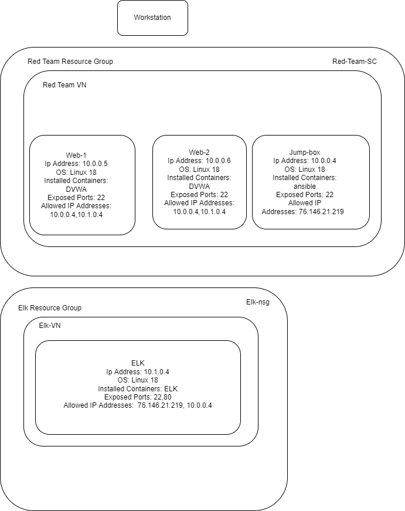
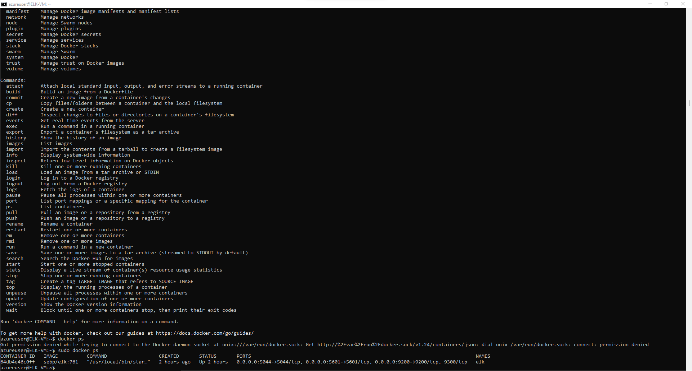

## Automated ELK Stack Deployment

The files in this repository were used to configure the network depicted below.

These files have been tested and used to generate a live ELK deployment on Azure. They can be used to either recreate the entire deployment pictured above. Alternatively, select portions of the playbook file may be used to install only certain pieces of it, such as Filebeat.

  - elk-playbook.yml

This document contains the following details:
- Description of the Topologu
- Access Policies
- ELK Configuration
  - Beats in Use
  - Machines Being Monitored
- How to Use the Ansible Build

### Description of the Topology

The main purpose of this network is to expose a load-balanced and monitored instance of DVWA, the D*mn Vulnerable Web Application.

Load balancing ensures that the application will be highly responsive, in addition to restricting access to the network.
- Load balancers help protect against distributed denial of service attacks. It shifts the attacking traffic from corprate servers to the public cloud server. 
- A jump box can restrict traffic so only public connections are made to it. This prevents direct access to internal servers. Also you can restrict traffic within the network easily by only allow access to other machines through the jump machine. 

Integrating an ELK server allows users to easily monitor the vulnerable VMs for changes to the CPU and system logs.
- Filebeat collects file activity logs and forwards them to elasticsearch for indexing
- Metricbeat records computer metrics data for the machine it's on. 

The configuration details of each machine may be found below.
_Note: Use the [Markdown Table Generator](http://www.tablesgenerator.com/markdown_tables) to add/remove values from the table_.

| Name     | Function       | IP Address | Operating System |
|----------|----------------|------------|------------------|
| Jump-Box | Gateway        | 10.0.0.4   | Linux            |
| ELK      | Kibana/Logging | 10.1.0.4   | Linux            |
| Web-1    | Web Server     | 10.0.0.5   | Linux            |
| Web-2    | Web Server     | 10.0.0.6   | Linux            |

### Access Policies

The machines on the internal network are not exposed to the public Internet. 

Only the Jump-Box machine can accept connections from the Internet. Access to this machine is only allowed from the following IP addresses:
- 76.146.21.219  
Machines within the network can only be accessed by 76.146.21.219.
- I allowed the jump-box access to the elk vm. It's IP address is 20.75.54.93

A summary of the access policies in place can be found in the table below.

| Name     | Publicly Accessible | Allowed IP Addresses |
|----------|---------------------|----------------------|
| Jump-box | Yes                 | 76.146.21.219        |
| Elk      | No                  |                      |
| Web-1    | No                  |                      |
| Web-2    | No                  |                      |

### Elk Configuration

Ansible was used to automate configuration of the ELK machine. No configuration was performed manually, which is advantageous because...
- it saves the technichian's time by having the computer do all of the configurations itself. This allows use of ansible to deploy a great number of configurations with only a click of a button. 

The playbook implements the following tasks:
- Checks and installs docker.io
- Checks and installs Python3-pip
- Checks and installs Python-docker (needed to fix an error)
- Checks and installs docker
- Increase amount of virtual memory available and set new memory use
- Download and launch docker elk container
- Enable docker on boot

The following screenshot displays the result of running `docker ps` after successfully configuring the ELK instance.

### Target Machines & Beats
This ELK server is configured to monitor the following machines:
- Web-1 10.0.0.5
- Web-2 10.0.0.6

We have installed the following Beats on these machines:
- Filebeat
- Metricbeat 

These Beats allow us to collect the following information from each machine:
- Filebeat collects system and log files
- Metricbeat collects metrics like CPU, memory usage, disk usage and other services

### Using the Playbook
In order to use the playbook, you will need to have an Ansible control node already configured. Assuming you have such a control node provisioned: 

SSH into the control node and follow the steps below:
- Copy the elk-playbook.yml file to /etc/ansible/roles.
- Update the config file to include the ip address of the elk server
- Update /etc/ansible/ansible.cnfg to use your remote user(azureuser) and update the private-key setting to use your private-key
- Run the playbook, http://20.75.54.93:5601/app/kibana and navigate to  to check that the installation worked as expected.

_TODO: Answer the following questions to fill in the blanks:_
- elk-playbook.yml is the playbook, it is copied to the roles folder
- You modify the hosts file in ansible to specify a specific machine. You have a group for elk and a group for webservers. [elk] will have the location to install elk and [webservers] will have a list of ips for web server machines to install filebeat on
- http://20.75.54.93:5601/ check that out to see if elk is running

_As a **Bonus**, provide the specific commands the user will need to run to download the playbook, update the files, etc._
